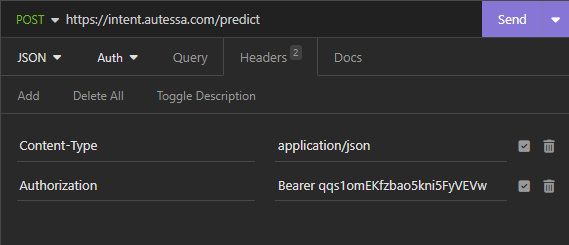

# Using Model API

After you've published an [intent model](autobot/inner/intent_model?id=publishing), you will have the option to export the model as an API you can make predictions to. 


<blockquote>
In order to use this feature, you will need to have valid <a href="#/basics/inner/payment_info">payment information</a> on file.
</blockquote>

## Accessing Published Models (IMAGES!)
To see your published models, head to the models page on the Autobot sidebar.

> IMAGES

Next, hit the published tab on the upper righthand side of the app page.

> IMAGES

Now you'll be able to see your published models. To export as an API, hit the **export** button for the model record to be taken to the API export dashboard.

> IMAGES

> :bulb: Don't see a published model? Make sure you've hit **publish** after training and testing one of your models!

## Creating API Key 1cow3AqdZGfn324dNbOg4Z14
Gating your API is a private **API Key**. Think of an API key as a password to use your API. Protect it as you would any secret.

To generate an API key, click the **Generate New API Key** at the bottom right of the application. 

> IMAGES

Create a good description to recognize the key (we will show you the description when describing the usage), and press the generate button. Store the API key in a safe place - Autessa will not be able to help you recover the key if you lose it. 

### Limits
Autessa sets a limit of 3 API keys issued for a given model at any time. If you have lost an API key, you can remove it to make room for more, and if you suspect fraudulent usage, mark the API key as inactive. 

You can see usage for all exported APIs in the Autobot dashboard. 

## Choosing Payment Strategy
Choose between pay per request and monthly quota payment options. For more details between the options, check out the [pricing page](autobot/inner/pricing).

We recommend starting with the **pay per request** option until you better understand your usage of the API.

*You cannot swap between the two payment strategies within a single payment period. If you want to swap from monthly quota to pay per request, and you do so on October 16, the change won't be in the system until the November billing cycle. If you want to change it and it's more urgent that that, please reach out!*

## Choosing API Configuration
We offer configurations to help keep your API more secure. These are designed to help you control the usage of the API.

### Throttle Rate
This is defined as number of requests that can be sent to the API in a minute. By default, we set the rate to 30 requests to the API in a 60 second period. 

If you are sharing this API with a number of clients, we recommend urging the client to first try and handle throttled requests by waiting to send the request, rather than increasing the throttle rate. 

### IP AllowList
Use this if you are using the API in a browser, but are in the development stage, so don't want anyone to be able to call the API and increase the usage :) Using the `X-Requested-For` header, the API will reject requests that are not in the allowlist of IP addresses. This field expects a **comma separated** list of IP addresses.

Leave the field blank if you want to support all IPs.

### Access Control Headers
This is a CORs setting for your API if you want to use your API in a web application. If an API request is made from a domain that you have not allowed, the browser will block the request to the API. This field expects a **comma separated** list of allowed domains.

> IMAGE

Leave the field blank to support all origins. 

## Calling the API
On the righthand side of the API Export dashboard, there will be a command for understanding how to call your API. 

To call the API, create a POST request to the endpoint `https://intent.autessa.com/predict`, and add the payload as:
```json
{
    "modelId": "whatever your ID is",
    "utterance": "How are you today?"
}
```
After that, set the headers to include the API key you generated in [Creating an API Key](#creating-api-key).

Below is an example of how I would set up the API call in insomnia for my particular API (and yes, the API key is now different for this model).

<html>
    <style>
        .image-container {
            width: 90%;
            margin: auto;
            display: flex;
        }
        .image-container img {
            width: 50%;
            height: auto;
            margin: 10px;
        }
    </style>
    <div class="image-container">
        
        
    </div>
</html>

### cURL
The cURL command to make a call to the API is provided when you export a model. 

```bash
curl -X POST \
https://intent.autessa.com/predict \
-H 'Content-Type: application/json' \
-H 'X-Requested-With: XMLHttpRequest' \
-H 'Authorization: Bearer {place your token here without brackets}' \
-d '{
  "modelId": "{place model ID here without brackets}",
  "utterance": "I want to buy some boots"
}' 
```

Paste this command (replacing the Authorization header with your secret token) in your terminal/command prompt to test out the API!

### Java
```java
import java.io.*;
import java.net.HttpURLConnection;
import java.net.MalformedURLException;
import java.net.URL;
import java.nio.charset.StandardCharsets;

public class Request {

    public static void makeRequest(String modelId, String token, String utterance) throws MalformedURLException {
        String apiUrl = "https://intent.autessa.com/predict";
        URL url = new URL(apiUrl);
        HttpURLConnection connection = null;
        try {
            connection = (HttpURLConnection) url.openConnection();
            connection.setRequestMethod("POST");
            connection.setDoOutput(true);
            connection.setRequestProperty("Content-Type", "application/json");
            connection.setRequestProperty("Authorization", "Bearer " + token);
            String requestBody = "{\"modelId\": \"" + modelId + "\", \"utterance\": \"" + utterance + "\"}";
            byte[] postData = requestBody.getBytes(StandardCharsets.UTF_8);
            connection.setRequestProperty("Content-Length", String.valueOf(postData.length));
            try (OutputStream os = connection.getOutputStream()) {
                os.write(postData);
            }
            int responseCode = connection.getResponseCode();
            if (responseCode == 200) {
                try (BufferedReader in = new BufferedReader(new InputStreamReader(connection.getInputStream()))) {
                    String inputLine;
                    StringBuilder response = new StringBuilder();
                    while ((inputLine = in.readLine()) != null) {
                        response.append(inputLine);
                    }
                    System.out.println("Response from the server:\n" + response);
                }
            } else {
                System.out.println("POST request failed with HTTP error code: " + responseCode);
            }
        } catch (IOException e) {
            e.printStackTrace();
        } finally {
            if (connection != null) {
                connection.disconnect();
            }
        }
    }

    public static void main(String[] args) throws MalformedURLException {
        String modelId = "";
        String apiKey = "";
        String utterance = "I want to buy some boots";
        makeRequest(modelId, apiKey, utterance);
    }
}
```

### Python
```python
import requests

utterance = "I want to buy boots"
api_key = ""
model_id = ""
endpoint = "https://intent.autessa.com/predict"
headers = {
    "Accept": "application/json",
    "Content-type": "application/json",
    "Authorization": f"Bearer {api_key}"
}

predicted_intent_response = requests.post(endpoint, json={
    "modelId": model_id,
    "utterance": utterance
}, headers=headers)
try:
    predicted_intent = predicted_intent_response.json()
    print(predicted_intent)
except Exception:
    print(predicted_intent_response)
```

### NodeJS
```javascript
const fetch = require('node-fetch');

const utterance = "I want to buy boots";
const api_key = "";
const model_id = "";
const endpoint = "https://intent.autessa.com/predict";
const headers = {
    "Accept": "application/json",
    "Content-type": "application/json",
    "Authorization": `Bearer ${api_key}`
};

fetch(endpoint, {
    method: 'POST',
    headers: headers,
    body: JSON.stringify({
        modelId: model_id,
        utterance: utterance
    })
})
.then(response => response.json())
.then(predicted_intent => {
    console.log(predicted_intent);
})
.catch(error => {
    console.error(error);
});
```

### AutessaScript
```javascript
const utterance = "I want to buy some boots";
const apiKey = "";
const modelId = "";
const payload = JSON.stringify({
    "modelId": modelId,
    "utterance": utterance
});
const endpoint = "https://intent.autessa.com/predict";
var apiResponse = api.post(JSON.stringify({
    "endpoint": endpoint,
    "payload": payload,
    "headers": {
        "Accept": "application/json",
        "Content-type": "application/json",
        "Authorization": `Bearer ${apiKey}`
    }
}));
Logger.log(apiResponse);
```

## Understanding Response (FILL OUT STILL)
The returned response from the API is in a JSON format.

### Headers
The API 

### Exceptions
Any exception message thrown will provide an error code of 403, 500, or 502. 


### Managing Quota and Throttle Headers
* Use the headers to see if you are approaching the throttle limit. If the request is throttled, wait a couple seconds and then resend the request
* Use the headers to determine if you are approaching monthly quota. If you are nearing monthly quota, increase the quota to keep the service available

> :bulb: Usage is not counted if there was an error with prediction
