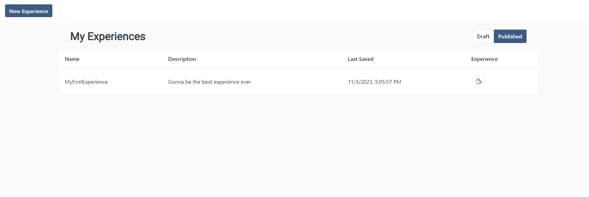
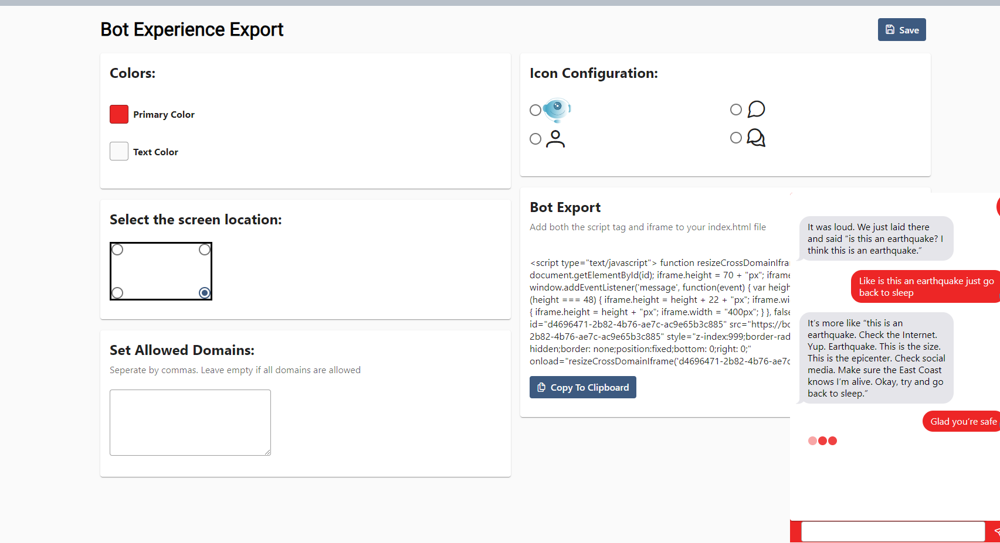

# Designing Bot Component
Once you've published an experience, you're ready to export it in a simple script to use! 

<blockquote>
In order to use this feature, you will need to have valid <a href="#/basics/inner/payment_info">payment information</a> on file.
</blockquote>

To access this page, head over the Experiences tab on the sidebar of Autobot. Then, navigate to the published experiences by clicking on the published tab. Afterwards, click on the export button next to the experience you want to export. 

    

## Supported Customization
Before using the bot, you may want to change the theme of the bot to match your website, rather than Autessa's default branding :) You can do this in the dashboard for customizing your experience. 

### Color
To change the color of the bot, use the color wheel to select the color you want to use. 

### Location
To change the render location of the bot, use the screen location checkbox. We currently support pinning the bot to the lower right, lower left, upper right, and upper left of a webpage. 

### Allowed Domains
To prevent other people from taking the script to run your bot and putting it on their website, we recommend setting an allowlist of domains for where the bot is allowed to render. If the bot is placed on page where you have not specified, it will not appear on the website and you will not be able to be charged. 

Specify this field as a comma separated list of allowed domains. If you leave this field empty, the bot will render on any domain. 

### Icons
Before a bot renders, it starts as a little circle that a user will have to click on to open the chat window. You can choose the icon that appears on the circle from our default options. 

## Test Rendering
To test the rendering within the Autessa sandbox, press the **Test** button in the upper right corner of the application. 

    

## Extracting Script
Now that you've customized your bot, the only thing you have to do is copy this snippet anywhere you want to use it!

Check out [Integrating Bot onto App](autobot/inner/html_snippet.md) for more information on how to use!

