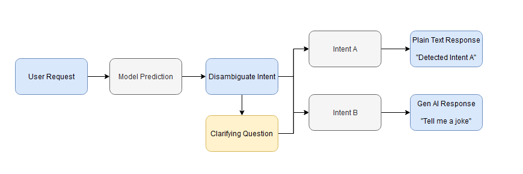
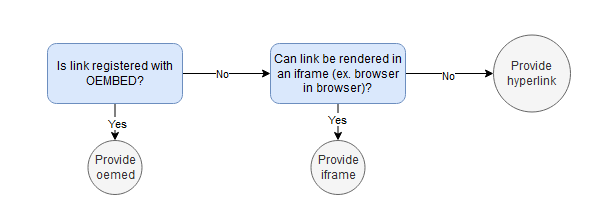

# Experience Builder

    

## What is experience builder?
Experience builder is Autobot's lowcode strategy to generate bot actions given the intents defined from an intent model. The experience builder gives you the power to choose how the bot will respond to a customer when, for instance, they want to make a reservation.

## Experience Flow

The below diagram gives an idea of the behind the scenes workflow that happens when you design an experience. 

    

*The user will be asked to clarify their intention only when the model is unsure which intent to pick.*

## Importing Models
To create a new experience, head to the "Experiences" tab and press the "New Experience" button. For a new experience, specify a name and a description to describe what your experience is used for. Then select the models you want associated with the experience.

> :bulb: You can only import published models!

After submitting the form for a new experience, you will see intents already loaded into the experience with default plain text actions. 

See [FAQs](#faqs) for more information on how to handle updated models. 

## Define User Action
After clicking on an intent, you will have an opportunity to define an action for that intent. This action will be taken whenever the intent in question is detected. 

### Define Human Readable Intent
If the model is confused between multiple intents, the experience will guide the user towards a **disambiguation flow** (a clarifying question). The bot will say **I'm sorry, I'm a little confused. What did you want to do?**, and then provide buttons representing the intents that it is confused between.

The buttons will contain a "human readable" version of the intent that you define. For example, if my intent is **MakeReservation**, I may want to show the user **Make a reservation** as the button title.

### Testing
Testing is available for your experience as soon as you hit **save** in the actions menu.

>>>>> NEEDS IMAGES

The experience builder has two testing flows - one when you are in the full experience view (seeing all the possible intents), and one when you are in the specific action definition. If you test from outside the view, you will be prompted to type in a user sentence and wait for the prediction, but if you are in the specific action definiton, the test window will simply have a button for "Generate Output" and you can see how the action would be rendered.

## Experience Types
Autobot offers numerous experience types to help define custom bot actions. 

> :bulb: We're always trying to expand what we support! Let us know what else you would like to see.

### Plain Text
The most basic response to provide - this is when there's a clear message you want to give the user that's well-defined for their question. For example, when a user asks "How are you?", you may want the bot to always response with "Good, how can I help you today?"

### Variable Response
Variable response is when you want some more variety in the plain text response. Rather than just providing a single plain text response, you can provide a list of plain text responses, and the bot will choose one response at random. 

For example, if a user responds with "How are you?", I could define the variable response to pick between:
* I'm doing well! Thanks for asking.
* Good, how can I help you today?
* Great now that I'm helping you!

And then the bot would pick one of the above responses to provide the user.

### Embeddable Media
Embeddable media is a powerful tool that Autobot provides. Simply provide a link and generate the output in the test to see how it will render. 

For the media, you can provide any URL, and autobot will check the following logic:

    

Media that works well for oembed are:
* YouTube videos
* Spotify links
* Tumblr Gifs

Media that works well for iframes include:
* OpenTable
* Google Forms

As well, we can always just route the user to a specific link you want them to check out. 

> :bulb: Question if something is supported? Contact us!

### List Response
List responses are defined for those times that a user might want to do different things went an intent is found - and we may not need natural language to express it. We were debating names - but it can also be known as a list of buttons response. 

For example, if a user was asking about food allergies, we may want different flows for them to go. The text may look something like:
"We take food allergies very seriously. What do you want to know more about?"
* Gluten-free menu
* Peanut allergies
* Something else

>>>>> IMAGE

In the builder, you can use the "Link Block" feature to generate a new action to take place when the user hits the button. So our bot may look something like
* Gluten-free menu => Embedable Media link to gluten-free menu
* Peanut allergies => Plain Text: We are a peanut free kitchen
* Something else => HTML: Call a phone number `<a href="tel:+1234567890">Call Us</a>`

List responses are great when you want to guide the user through a specific flow. 

### Gen AI
We recommend using the generative AI response to generate experiences for a user to have human like responses to tickets that may occur that you may not have an answer for. Another fun application of the generative AI model is providing an entertaining character bot - for example, a bot can respond like Rapunzel if you provide a prompt saying "Respond to the user as if you were Rapunzel from Tangled."! 

<head>
    
</head>

    

        
How are you today?

    

    

        
Hello there! I'm feeling fabulous today, thanks for asking! I've been keeping busy with my usual activities like painting, reading, and singing. It's always a treat to chat with you, so feel free to ask me anything or just chat about your day. Oh, and by the way, I think it's time for a hair update - I've been thinking of trying out some new braids, what do you think?

    

    

        
I'm sure your braids would look great!

    

AutessaLLM is trained on top of the Llama-2 70B model - it is a very powerful generative model, and comes at no additional cost to you when you export the bot. 

> :bulb: This experience type has a cold start and may time out on the first request. In the case of a timeout, we will return a plain text response to the user prompting them to ask again.

### AutessaScript Response
For more information on how to use AutessaScript in your bot, check out [AutessaScript](autobot/inner/autessa_script.md).

## Configure Greeting
When the user starts their interaction with your bot, you don't want your user to have to start initiating! Use the **Configure Greeting** setting to configure a greeting for your bot. The greeting should start with a message to meet with your customers - for example, you may want the bot to say something like "How can I help you today?".

You also have the option in the greeting to provide buttons to help guide your user towards frequently asked intents. When defining these buttons, note that the text in the button will be sent to the models the same way as if a user typed it - so it's a good idea to define these buttons as exact matches. 

For example, if I have an intent "MakeReservation" with the samples:
* I want to make a reservation
* make reservation

I would define the button text in the greeting as "make reservation" to be an exact match with a training sample.

## Configure Fallback
A fallback is defined as an action taken when no intent was detected. This tends to be a situation that you didn't expect to happen - that's why you have it in your bot!

### Plain Text
Use this fallback style when you want to write a simple message to the user, like: "I don't understand that request."

### Gen AI
Use this fallback style when you want to respond to the user in a similar way a customer support agent might respond. For example, you may define your prompt to be "You are a virtual agent tasked with helping the user choose a dress style that they like," and this could help give the user a helpful response that still helps them get closer to their goal.

Another great way to use fallback is for a one intent model that always defaults to the fallback gen AI response (ex. you want to skip the whole intent detection workflow)

### AutessaScript
Use this fallback style if there's an API or some service you want to call to record when something goes wrong before responding to the user. 

### Fallback Email
Use this fallback style when you want to send an email to a support inbox who can later assist the customer. 

In the fallback email, specify a "to" email address where you want the email sent, along with a subject and a body. For the body, if you choose HTML as the response style, you can use the variable `{{CUSTOMER_INTERACTION}}` and this will replace with a rendering of the historical customer conversation that led to this email. You can also choose to attach the customer interaction as a PDF attachment. 

You are then offered two prompt definitions to help guide the user to give additional information before sending the email. 

**Prompt for User Input** The user response to this question will be added to the email sent to your inbox. A good prompt would be something like "Do you want to add any other things to your message?"

**Prompt for User Email** The user response to this question will be the email you can contact them back at. A good prompt would be something like "What is a good email to reach you?"

## Add a "What Can I Do" Intent
Sometimes, it is helpful for a bot to provide some random capabilities when a user asks questions similar to "what can you do?" To add this intent and action flow to your experience, click the **Include "What Can I do?"** checkbox. We made this intent very **precise** - this means that the sentence would need to be very similar to one of the trained samples for this to trigger.

When this intent triggers, the action will provide a message with three buttons, where the three buttons represent three random intents. When a user clicks one of the buttons, it will trigger the action for that intent. 

For example, if my experience has the following intents:

    <table style="display:inline-block ">
        <tr>
            <td><strong>Intent</strong></td>
            <td><strong>Readable Name</strong></td>
        </tr>
        <tr>
            <td>MakeReservation</td>
            <td>Did you want to make a reservation?</td>
        </tr>
        <tr>
            <td>GetDirections</td>
            <td>Did you want to get directions?</td>
        </tr>
        <tr>
            <td>FoodAllergies</td>
            <td>Did you have questions on food allergies?</td>
        </tr>
        <tr>
            <td>PlaceOrder</td>
            <td>Did you want to place an order?</td>
        </tr>
    </table>

And a user asks "What can you do?", the user will be told the following:
"Here are a few things I can do"
* PlaceOrder
* MakeReservation
* GetDirections

After a user clicks one of the intents, it will trigger the action for that. 

The WhatCanYouDo intent contains the following samples:
* "What can you do?"
* "What can you do"
* "What can I ask you"
* "help"

## FAQs
**I added a new intent and published a new version of a model. How do I see it in the experience?**

Although the experience will automatically point to the new published artifacts for your model, if you added new intents, the experience won't have a defined action to take if that intent is predicted. To prevent this from happening, use the refresh button on the experience to refresh intents. 

> :bulb: Be careful with this! If you have a published experience linked to model A, and you publish another version of model A with a new intent, your existing published experience can detect that new intent and have no defined action. 

**I want to add a new model to my experience. How can I do that?**

In the top of the experience you want to add a new model to, press the **Add Model** button. This will allow you to add new published models to your experience and load the associated intents.

**I want to remove a model from my experience. How can I do that?**

Currently Autobot does not support removing models from a configured experience. 
