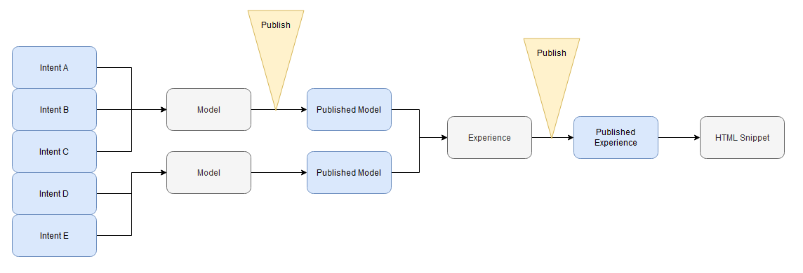

# Getting Started

    <video style="object-fit:cover;" width="100%" height="100%" oncontextmenu="return false;" controls>
        <source src="https://autessa-public-bucket.s3.us-west-2.amazonaws.com/autobot_internal_demo.mp4" type="video/mp4">
            Your browser does not support the video tag.
    </video> 

## Using Autobot for the first time
When starting with Autobot, we recommend first creating an intent model. In your intent model, you will define some intents, or actions, that a user may want to do when interacting with your bot, along with some sample sentences that a user might say. After training and testing your model, you can publish the model. This model is now yours to use as an [API](autobot/inner/api_export.md) or in an [experience](autobot/inner/experience_builder.md) (or both!).

    

The experience builder is where you can define bot actions when an intent is detected. When adding a model to an experience, the intents defined will be automatically added to the view. You can click on any of these intents to define the action the bot will take when an intent is detected, as well as the user experience. Learn more about the actions supported [here](autobot/inner/experience_builder.md).

----------

To better understand how the components interact, take a look at the below diagram. 

* A **model** is created from a series of **intents** that you define
* You can train the **model** on these intents
* When you publish a model, it is now a second copy of the model at that stage known as a **published model**
* You can create an **experience** from multiple published models
* You can create a **published experience** by publishing your experience, generating a copy of the draft experience at that state
* You can generate an **HTML snippet** from a published experience
