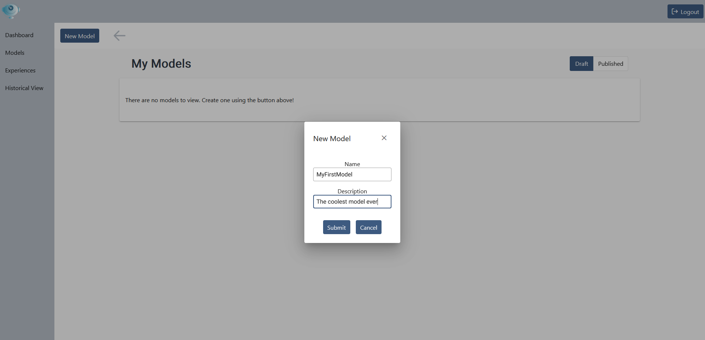
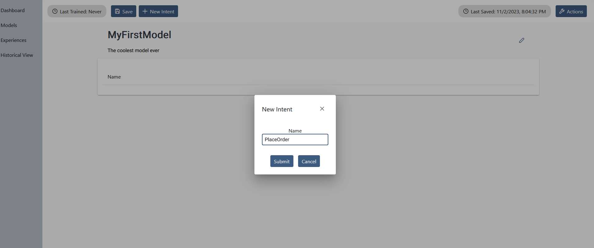
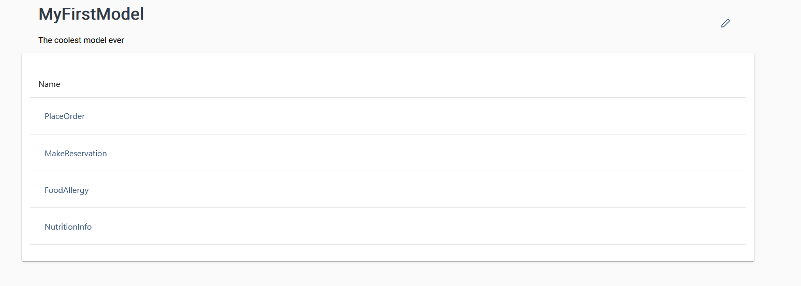
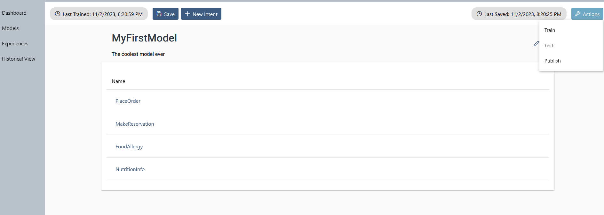
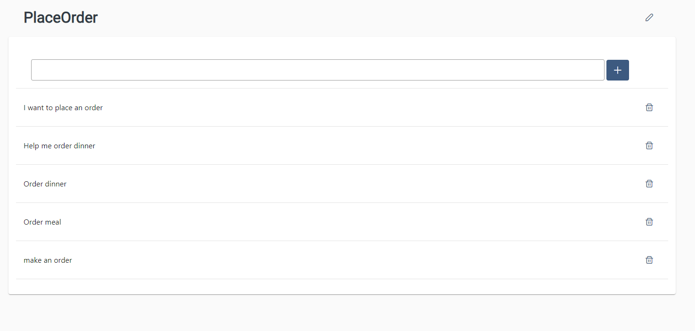
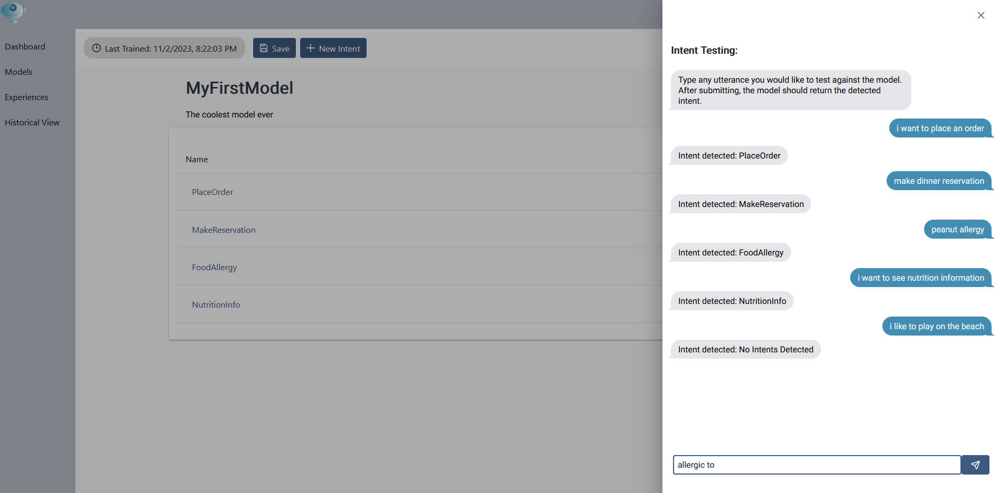

# Creating Intent Model
At the core for your Autobot exists an intent model. This intent model is the key to processing user input using NLU techniques to understand what is the "intent" behind the user request. 

## What is an intent model?
An intent model is an natural language understanding (NLU) model to help classify user sentences as a category (or intent). The idea is that YOU define these intents, and train the model by showing examples of what that intent might look like. An intent model is made up of intents and relevant samples (or sentences) representing those intents. When you train the model, we use the latest ML techniques to get the best inference results. 

> :bulb: Pro Tip! You can use this intent model for more than just short text. For example, you can build a sentiment model by creating two categories: positive and negative, and provide examples of each. 

## Design
Before you start creating a model, you should have an idea of what you want the bot to do. A good place to start is understanding what are the frequent topics that users ask about. For example, if I am running a restaurant, users often call to do the following:
- Place an order
- Make Reservation
- Understand food allergy practices
- Get nutrition information

    
    

With this as a starting point, I would then create intents for each of these topics so the model can determine what the user was intending to do.

### Defining Intents
Intent names should typically be one word, we recommend using **camel case** to turn multiple words into a single world. An example is if I have a word like "make reservation", I can use camel case to transform the intent name to be: "makeReservation". Try out the camel case converter below!

<html>
    <head>
        
    </head>
    <body>
        

            <form id="inputForm">
            <input style="margin-top:10px" type="text" id="inputString" required>
            <button class="button" type="button" style="margin-top:10px;margin-bottom:10px" onClick="updateOutput()">Convert to Camel Case</button>
            </form>
            
&nbsp;

        
  
    </body>
</html>

### Rename Intent
If, after creating the intent, you want to change the name, click the pencil button in the intent view. Then you will be able to change the intent name to whatever you want.

> :bulb: Remember, all intent names should be unique!

To generate example sentences, see [Adding Data](#adding-data)

    

## Training
When you click "Train", Autobot launches a powerful training cluster of models - a transformer-based similarity model, a transformer-based classification model, and a transformer-based generative model. After completing the training for these custom models designed for you (within minutes!), we create an arbitration solution, so when you make a prediction, it provides the best possible prediction for you. 

    

### Adding Data
When generating training data for your model, be sure to include a variety of different sentence structures and words. Although you only need ~10 samples to define an intent, adding more samples only helps the model better understand what you mean. Autobot will not train if you provide less than 5 samples. 

    

> :bulb: Before training, be sure to **save** your model - the model trains based on your last saved changes.

To train, just click the train button, located in the **actions** menu in the upper right. Your model will be in a locked state during training so that your changes can stay in sync :)

## Testing
Once training is completed, your model will be unlocked, and you'll be ready to test! To test, just click the "test" button, located in the **actions** menu. A window will pop up with space for you to provide some samples that the user might say. For each prediction, you will see the intents that were detected for that sentence. 

    

If you are not happy with the performance, adjust the training samples provided to improve performance. If you would like help with strategies to build a model for your use case, drop us a line! We're always happy to help. 

## Publishing
After you feel good about your model's performance, you're ready to publish. When you publish, a version of the model is created as a snapshot of what you currently had trained. Then, a second version of the model is created, having never been trained, and is set to version 2. Whenever you make changes to your model and train, it will not affect the published version **until** you hit publish. 

Check out the next pages for information on how to use your model outside of the test console.

<html>
    <head>
        <link rel="stylesheet" href="https://unpkg.com/primeflex@^3/primeflex.css">
        <link href="https://fonts.googleapis.com/css2?family=Roboto&display=swap" rel="stylesheet">
    </head>
    <body>
        

            

                <h3><a href="#/autobot/inner/api_export">API</a></h3>
                

                

                    <h3><a href="#/autobot/inner/bot_component">Bot</a></h3>
                

            

        

    </body>
</html>

## Best Practices

### Avoid overlap between intents
Try to avoid having intents with very similar sentences. Too much overlap might make it difficult to train the model (however, if our model is unsure, we will return multiple intents) to differentiate between the different categories. 

### Continuously Iterate
Keep an eye on what kind of inputs are sent to your model and your model's predictions in the [history](autobot/inner/history.md) dashboard. If you see gaps in the model's predictions compared to how users are using it, make adjustments!

## FAQs

**I've added intents since I last published. How do I have it reflected in experience?** 

After you have published a new version of the model with more intents, click the refresh icon in the experience to have it reflected. 
