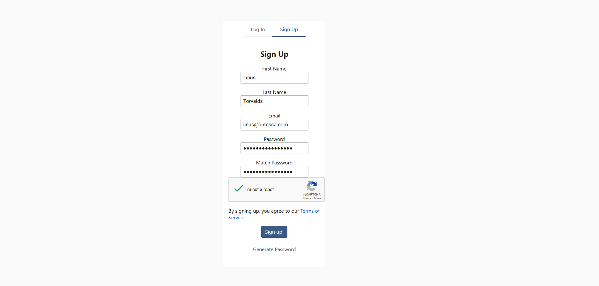
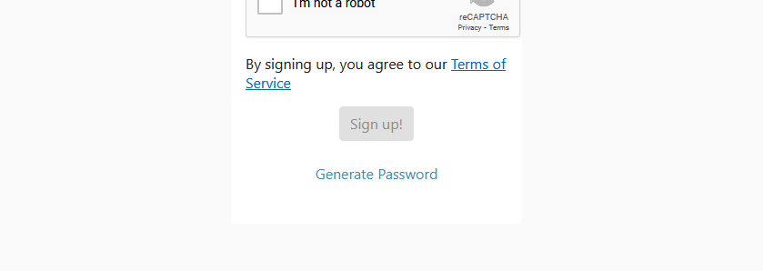
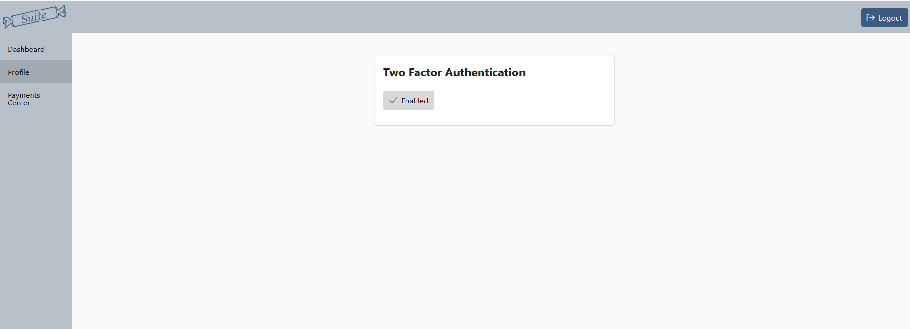

# Create an Account
Congratulations on your decision to work with Autessa! Now it's time to get our feet wet and start working within the suite.

## How to register
Creating an account with Autessa is simple. 

1) Head over to the Suite page at [https://suite.autessa.com](https://suite.autessa.com)
2) In sign up, fill out the required forms (see [Password Generator](#using-password-generator))
3) After signing up, you will receive an email to activate your account
4) Once you've activated your account, you're free to use the suite!

    

### Using password generator
At the bottom of the sign up page, you will see a button called "Generate Password". We highly recommend using a password manager, or our own random password generator, to choose your password for Autessa to protect your account and your information!

    

## Set up Two Factor
To further protect your account, we highly recommend setting up two factor for the account. To do this, navigate to the Profile section on the sidebar of the Suite profile. Here, there will be a single page you can use to enable two factor. 

We currently support two factor by sending you an email with a 6 digit code. 

    

## Trouble Logging In?
Refresh the page - we're still in a V1 stage of Autessa, so there are some kinks we're still working through. But refreshing the page helps us. If it doesn't work for you, don't hesitate to [reach out](https://autessa.com/contact-us) using the bot!
